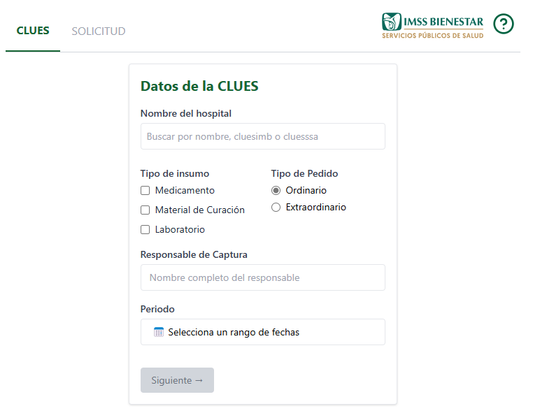

# 📦 Solicitudes App – Frontend Angular

Aplicación desarrollada con Angular 17 + TailwindCSS para capturar, visualizar y exportar solicitudes de insumos hospitalarios y de unidades médicas en IMSS-Bienestar.

Incluye autocompletado, validaciones, persistencia local, dashboard analítico, exportación avanzada a Excel y generación opcional de archivos de precarga para futuras solicitudes.




[](https://app.netlify.com/projects/imssb-bc/deploys)


---

## ✨ Características Principales

* 🏥 Captura guiada para hospitales (Segundo Nivel) y unidades médicas (Primer Nivel)
* 🔎 Autocompletado inteligente de CLUES SSA / IMB, nombre o municipio
* 💾 Guardado automático en `localStorage` persistente tras recargas
* 📊 Dashboard ejecutivo de citas: KPIs, filtros, gráficas y análisis por proveedor
* 🧾 Exportación profesional a Excel (respetando plantilla institucional)
* 📥 Generación opcional de archivos de precarga reutilizables
* 🧠 Ayuda contextual adaptativa según el nivel de captura
* ⚙️ Normalización automática de claves conforme al Compendio Nacional de Insumos
* 🚀 Animación de carga con icono rotativo para refresco de datos
* 🔐 Validaciones progresivas para evitar errores de captura

---

## ⚙️ Tecnologías utilizadas

* ✅ Angular 17 (Standalone Components + Signals)
* 🎨 TailwindCSS v3.4
* 📦 ExcelJS para manipulación avanzada de `.xlsx`
* 📊 ng2-charts (Chart.js) para gráficas dinámicas
* 💬 Lucide Icons con animaciones (`animate-spin`)
* 🧠 RxJS + almacenamiento local (`localStorage`)

---

## 📁 Estructura del Proyecto

```bash
/src 
├── app/
│   ├── layout/                  # Layout principal con tabs y ayuda contextual
│   ├── features/
│   │   ├── captura-clues/       # Tab 1 – Captura de CLUES hospital / unidad
│   │   ├── solicitudes/         # Tab 2 – Captura de artículos
│   │   ├── dashboard/           # Dashboard ejecutivo (KPIs, proveedores, cumplimiento, pendientes)
│   ├── shared/
│   │   ├── periodo-picker/      # Selector de rangos de fechas
│   │   ├── confirmacion-modal/  # Modal de confirmación reutilizable
│   │   ├── nombrar-archivo-modal/ # Modal para nombrar archivo al exportar
│   │   ├── nombre-mes.pipe.ts
│   │   ├── truncate-decimal.pipe.ts
│   │   └── periodo-fechas.service.ts
│   ├── services/
│   │   ├── articulos.service.ts
│   │   ├── citas.service.ts
│   │   └── excel.service.ts
```

---

## 📤 Exportación a Excel y precarga

Exporta usando plantilla institucional (`/public/template.xlsx`) con estructura:

| Celda Excel | Contenido exportado                                                        |
| ----------- | -------------------------------------------------------------------------- |
| `B4`        | Nombre del hospital o unidad médica                                        |
| `E4`        | Tipos de insumo seleccionados (ej. Medicamento, Material de Curación)      |
| `F5`        | Periodo de solicitud formateado (ej. 01-30 ABRIL 2025)                     |
| `F7`        | Tipo de pedido (Ordinario / Extraordinario)                                |
| `F8`        | Responsable de la captura                                                  |
| `B12+`      | Número de renglón                                                          |
| `C12+`      | Clasificación VEN                                                          |
| `D12+`      | Clave CNIS normalizada                                                     |
| `E12+`      | Descripción                                                                |
| `F12+`      | Unidad de medida                                                           |
| `G12+`      | Cantidad solicitada. Se pinta **rojo** si supera CPM, **azul** si es menor |
| `H12+`      | CPM disponible. Se pinta **amarillo** si es cero                           |
| `I12+`      | Existencias AZM                                                            |
| `J12+`      | Existencias AZT                                                            |
| `K12+`      | Existencias AZE                                                            |

✅ Ordena automáticamente por clave antes de exportar
✅ Muestra clasificación VEN (Vital, Esencial, No esencial) según catálogo
✅ Incluye imagen institucional (`imssb-logo.png`) al encabezado
✅ Envia el archivo como base64 al backend para registrar historial (no solo descarga local)

Además:

* **Precarga:** Permite generar un archivo `.xlsx` sencillo con columnas clave, ven, descripción, unidad y cantidad, para ser reutilizado o compartido.
* **Importación de precarga:** Al importar, acumula cantidades de claves repetidas y valida restricciones (por ejemplo, si es captura en Primer Nivel, filtra claves no autorizadas).

---

### 🖌️ Ejemplo visual de colores en celdas

| Escenario      | Color aplicado |
| -------------- | -------------- |
| Cantidad > CPM | Texto rojo     |
| Cantidad < CPM | Texto azul     |
| CPM = 0        | Fondo amarillo |

---

### 🔧 Funciones auxiliares clave

* **`descripcionVEN()`** → Busca clasificación VEN según clave
* **`convertirBufferABase64()`** → Convierte ExcelJS buffer a string base64
* **`descargarArchivo()`** → Descarga archivo en el navegador
* **`leerArchivoPrecarga()`** → Lee Excel/CSV para precarga de insumos
* **`procesarArchivoCPMS()`** → Procesa archivo oficial de CPM por unidad

---

## 🧪 Cómo ejecutar localmente

```bash
git clone https://github.com/makadown-coders/solicitudes-app.git
cd solicitudes-app
npm install
npm run dev  # o ng serve
```
---

## 💬 Notas clave

* Las claves con prefijo `060`, `080`, `070` son mostradas conforme al Compendio Nacional, omitiendo sufijos locales como `.00`. Algunas excepciones se mantienen cuando representan variantes relevantes (p. ej., calibres).
* En Primer Nivel, solo es posible solicitar insumos del listado autorizado (ver `articulos-primernivel.json`).
* El sistema adapta automáticamente la interfaz y validaciones según el modo de captura.

---

## 📈 Justificación técnica: Netlify como plataforma de despliegue

| Criterio                        | Evaluación                              |
| ------------------------------- | --------------------------------------- |
| Frecuencia de uso               | 1 vez al mes por 15 unidades/hospitales |
| Peso de archivos `.xlsx`        | < 200 KB                                |
| Ancho de banda mensual estimado | ≈ 6 MB                                  |
| Seguridad                       | HTTPS automático                        |
| Costo                           | \$0 pesos                               |
| Deploy automático desde GitHub  | ✅                                       |

---

## 📄 Licencia

MIT © 2025 Mario Arturo Serrano Flores
Consulta el archivo LICENSE para más información.

